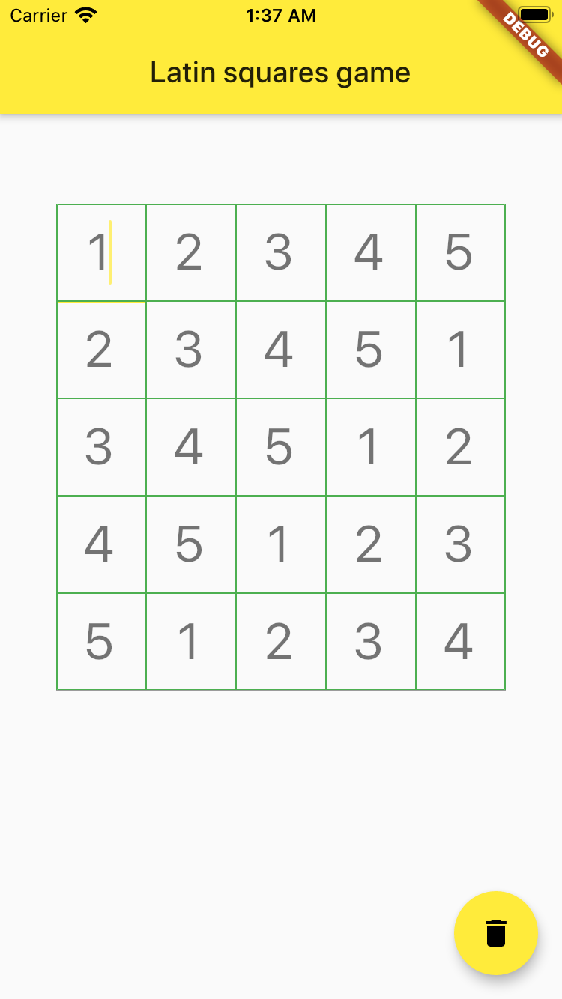

# latinsquaresgame

Latin squares game.
It means, no column, no row can have duplicated numbers.

[▶️ online demo](https://dartpad.dev/71b93e18f9d72479d85cd07ce8f99e48)

## Status

Proof of concept.

Lets user to solve simple 5x5 puzzle.

To start new game, please tap the trash bin icon.

# Todo

* Check if user is cheating with numbers more than dimension.
