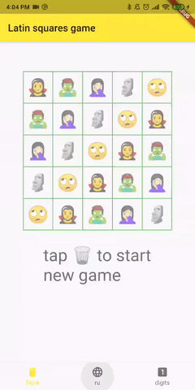

# Latin squares game

Latin squares game.
It means, no column, no row can have duplicated numbers.

[▶️ online demo](https://dartpad.dev/71b93e18f9d72479d85cd07ce8f99e48)

## Status

Proof of concept.

Lets user to solve simple 5x5 puzzle.

To start new game, please tap the trash bin icon.

## Flutter dev. info

* Continuous integration & deployment (CI/CD) using GitHub Actions
* Unit, Widget & Functional tests
* Code linting, formatting
* Git hooks
* Generated launcher icons
* Localizations

# Todo

* Automatically record gameplay.gif.
* Translate the rest.
* Put help move in the easiest place (that has less different variants).
* Revert last move (back).
